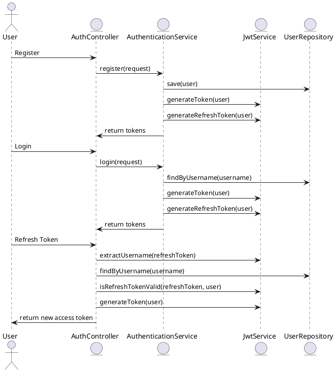

### 🔐 JWT Role-Based Authentication

### 📄 Access OpenAPI Documentation
After adding the necessary dependencies, you can access the OpenAPI documentation and Swagger UI through the following URLs:

1. **OpenAPI JSON:** [http://localhost:8080/v3/api-docs](http://localhost:8080/v3/api-docs) 📋
2. **Swagger UI:** [http://localhost:8080/swagger-ui.html](http://localhost:8080/swagger-ui.html) 🖥️

#### 📚 Using Spring Doc
For more detailed information and advanced configurations, refer to the official Spring Doc documentation:
- [Spring Doc Official Website](https://springdoc.org/) 🌐

### 🗃️ Database Schema (DBML for dbdiagram.io)

```dbml
Table users {
  id bigint [pk, increment]
  username varchar [unique, not null]
  email varchar [unique, not null]
  password varchar [not null]
  role varchar
}
```

#### Explanation
- **Table `users`:** Represents the User entity.
    - **id:** Primary key, auto-incremented.
    - **username:** Unique and not null.
    - **email:** Unique and not null.
    - **password:** Not null.
    - **role:** Enum type stored as a string.

### 📊 PlantUML Diagram



#### Explanation
- **Actors and Entities:**
    - **User:** Represents the end-user interacting with the system.
    - **AuthController:** Handles HTTP requests for authentication.
    - **AuthenticationService:** Manages authentication logic.
    - **JwtService:** Handles JWT token generation and validation.
    - **UserRepository:** Interacts with the database to manage user data.

- **Processes:**
    - **Register:** User sends a registration request, which is processed to create a new user and generate tokens.
    - **Login:** User sends login credentials, which are authenticated to generate tokens.
    - **Refresh Token:** User requests a new access token using a refresh token.

### 📁 Project Structure

```plaintext
spring-boot-jwt-role-based-authentication/
│
├── .idea/
├── .mvn/
├── src/
│   ├── main/
│   │   ├── java/
│   │   │   └── org/
│   │   │       └── tutorials/
│   │   │           ├── config/
│   │   │           │   ├── OpenApiConfig.java
│   │   │           │   └── SecurityConfig.java
│   │   │           ├── controller/
│   │   │           │   ├── AdminController.java
│   │   │           │   ├── AuthController.java
│   │   │           │   └── UserController.java
│   │   │           ├── dto/
│   │   │           │   ├── AuthenticationRequest.java
│   │   │           │   ├── AuthenticationResponse.java
│   │   │           │   ├── RefreshRequest.java
│   │   │           │   └── RegisterRequest.java
│   │   │           ├── entity/
│   │   │           │   ├── Role.java
│   │   │           │   └── User.java
│   │   │           ├── exception/
│   │   │           │   └── GlobalExceptionHandler.java
│   │   │           ├── mapper/
│   │   │           │   └── UserMapper.java
│   │   │           ├── repository/
│   │   │           │   └── UserRepository.java
│   │   │           ├── security/
│   │   │           │   ├── CustomUserDetailsService.java
│   │   │           │   ├── JwtAuthenticationFilter.java
│   │   │           │   └── JwtService.java
│   │   │           ├── service/
│   │   │           │   └── AuthenticationService.java
│   │   │           ├── validator/
│   │   │           └── SpringBootJwtRoleBasedAuthenticationApplication.java
│   │   └── resources/
│   │       ├── static/
│   │       ├── templates/
│   │       └── application.properties
│   └── test/
│
├── target/
├── .gitattributes
├── .gitignore
├── HELP.md
├── mvnw
└── mvnw.cmd
```

#### Explanation
- **`.idea/`:** IntelliJ IDEA project files.
- **`.mvn/`:** Maven wrapper files.
- **`src/`:** Main source code directory.
  - **`main/`:** Contains the main application code.
    - **`java/`:** Java source files.
      - **`org/tutorials/`:** Base package for the application.
        - **`config/`:** Configuration classes.
        - **`controller/`:** REST controllers.
        - **`dto/`:** Data Transfer Objects.
        - **`entity/`:** JPA entities.
        - **`exception/`:** Exception handling.
        - **`mapper/`:** Mappers for converting between entities and DTOs.
        - **`repository/`:** JPA repositories.
        - **`security/`:** Security-related classes.
        - **`service/`:** Service layer classes.
        - **`validator/`:** Validation classes.
    - **`resources/`:** Configuration files and static resources.
  - **`test/`:** Test source code directory.
- **`target/`:** Build output directory.
- **`.gitattributes`:** Git attributes file.
- **`.gitignore`:** Git ignore file.
- **`HELP.md`:** Help documentation.
- **`mvnw` and `mvnw.cmd`:** Maven wrapper scripts.

---